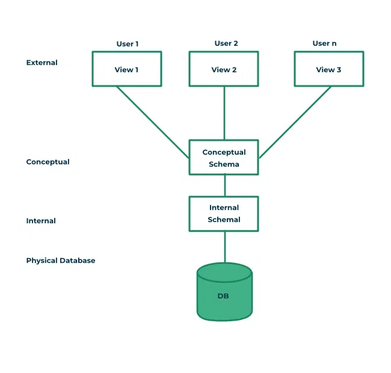

# what is DBMS  ?

 1. stands for  database management systems 
 2. DBMS provides relationship b/w tables 
 3. DBMS is used to follow MF code rules to provides relationship b/w tables
 4. DBMS is used to normalized the tables 
 5. DMBS is used to normalized the tables using its key constraints PK | FK | UK | CK 

# architectures of DBMS 

 