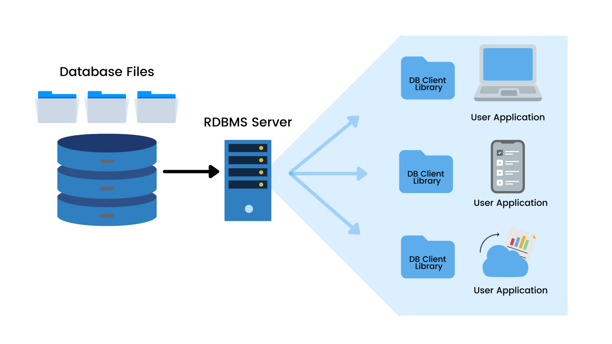

# what is RDBMS  ?

 1. stands for relational database management systems 
 2. RDBMS provides relationship b/w databases 
 3. RDBMS is used to follow MF code rules to provides relationship b/w databases 

# architectures of RDBMS 

 