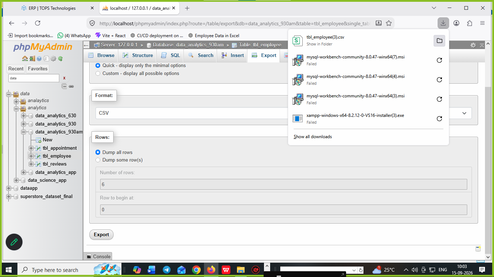
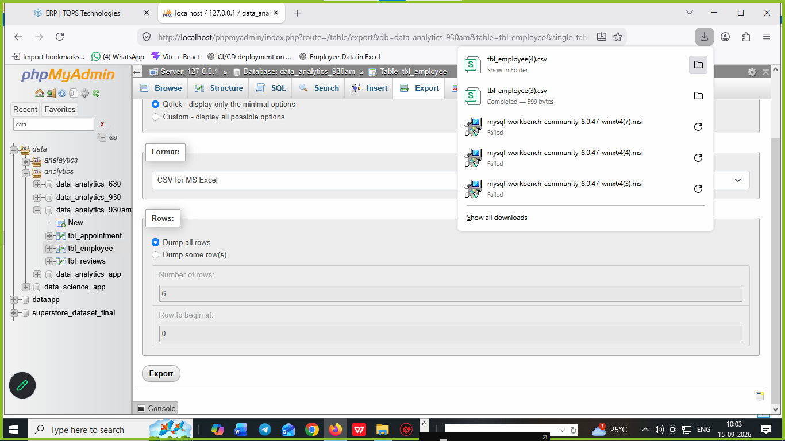
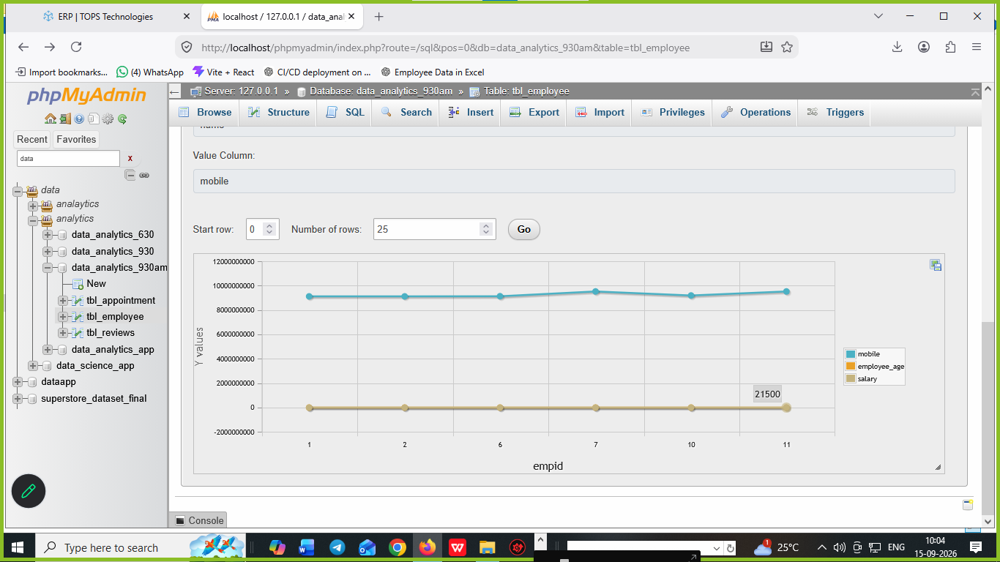
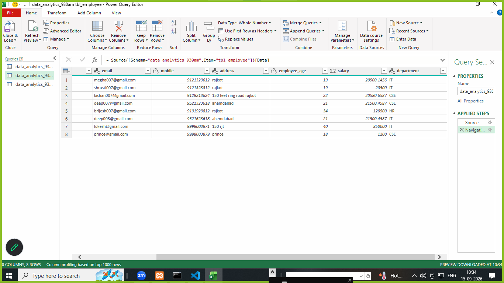
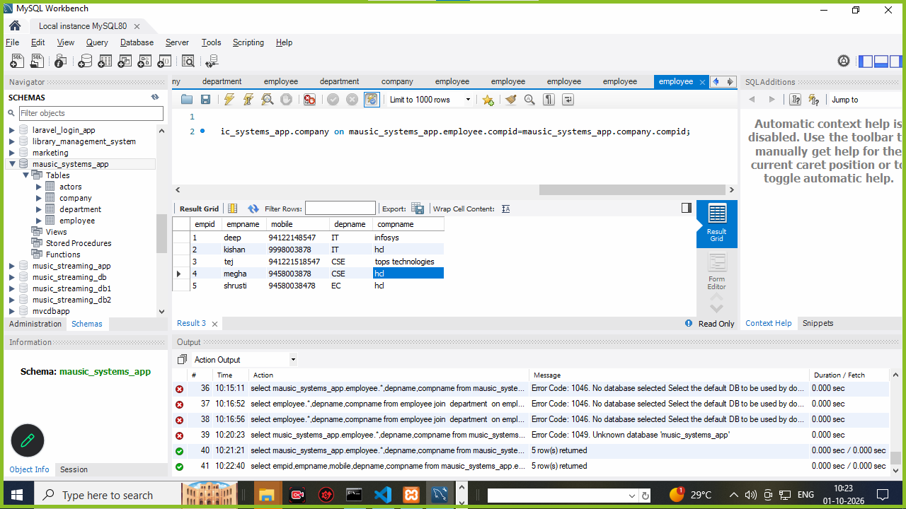
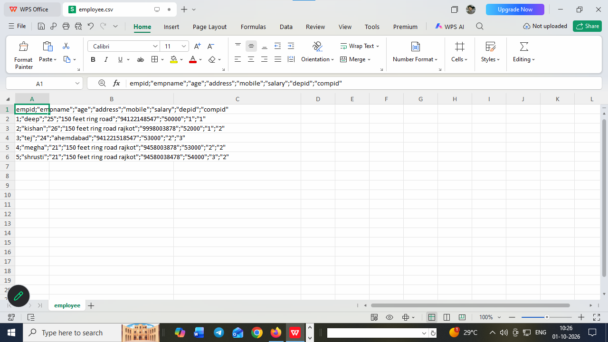
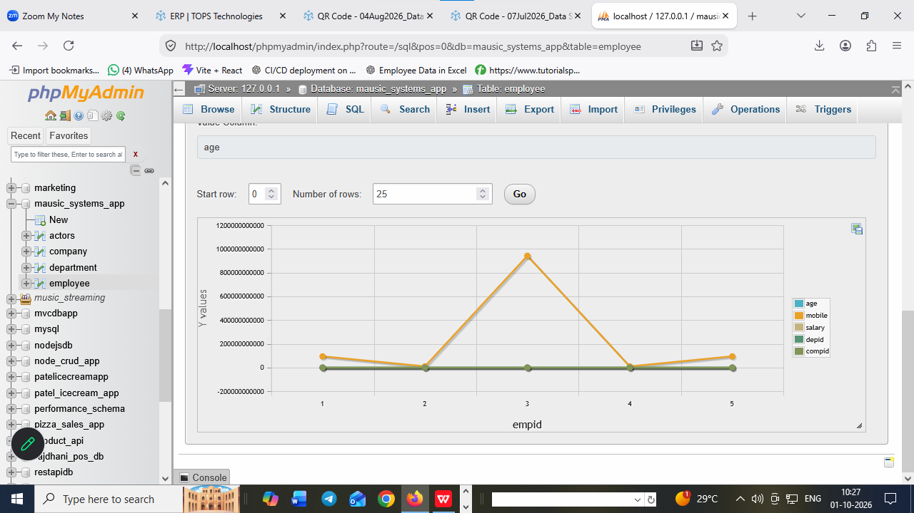
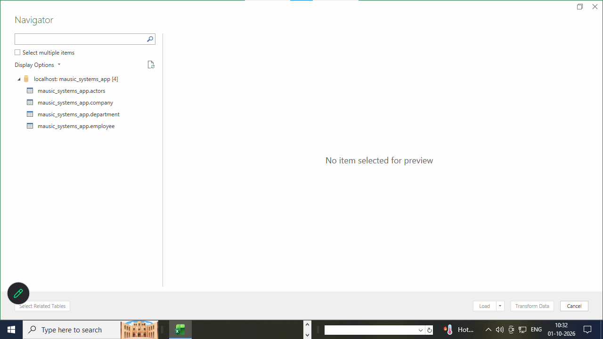
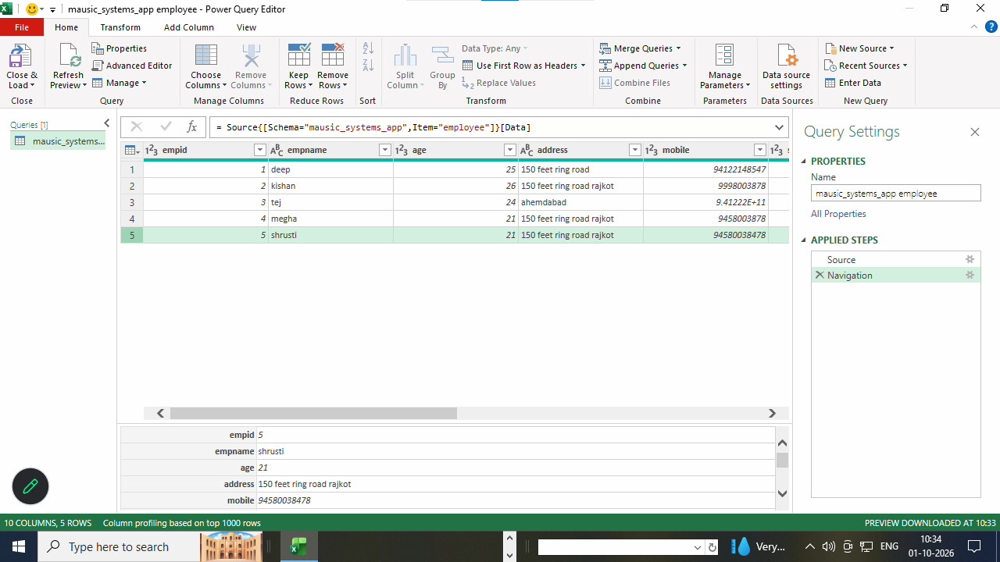

# what is SQL ? 

1. SQL stands for structured query language 
2. SQL create a database and table structured 
3. SQL is used to create an schemas of database or table 
4. SQL is case-incenstive language
5. SQL should be conditional
6. SQL should not be logical 


**examples**
```
insert | INSERT | Insert

```  
5. SQL create tables structured with its data types and size of each column 

**chart of tables column name and its size**


# SQL Data Types Reference

| Column Name | Data Type | Size | Description |
|-------------|-----------|------|-------------|
| id | INT | 11 | Integer value, commonly used as a primary key |
| name | CHAR | 1–255 | Fixed-length character string |
| name | VARCHAR | 0–255 | Variable-length string; accepts letters, numbers, and special characters |
| password | VARCHAR | 8–255 | Variable-length string used to store a password/hash |
| email | VARCHAR | 5–255 | Stores an email address |
| phone | VARCHAR | 7–20 | Stores a phone number |
| age | INT | 11 | Stores an integer value such as age |
| price | DECIMAL | 10,2 | Stores exact decimal numbers, e.g. 99999.99 |
| salary | DECIMAL | 10,2 | Stores salary or monetary values |
| quantity | INT | 11 | Stores whole-number quantities |
| status | TINYINT | 1 | Commonly used for boolean values such as 0 = false, 1 = true |
| is_active | BOOLEAN | 1 | Stores TRUE or FALSE |
| gender | CHAR | 1 | Stores a single character |
| description | TEXT | 65,535 bytes | Stores long text |
| address | VARCHAR | 0–255 | Stores an address |
| city | VARCHAR | 0–100 | Stores a city name |
| state | VARCHAR | 0–100 | Stores a state name |
| country | VARCHAR | 0–100 | Stores a country name |
| pincode | VARCHAR | 4–10 | Stores postal/PIN codes |
| date_of_birth | DATE | 3 bytes | Stores a date in `YYYY-MM-DD` format |
| created_at | DATETIME | 8 bytes | Stores date and time |
| updated_at | DATETIME | 8 bytes | Stores date and time of last update |
| login_time | TIMESTAMP | 4 bytes | Stores a timestamp |
| year | YEAR | 1 byte | Stores a year |
| image | BLOB | Up to 65,535 bytes | Stores binary data such as a small image |
| file_data | LONGBLOB | Up to 4 GB | Stores large binary files |
| notes | TEXT | 65,535 bytes | Stores additional text/notes |
| json_data | JSON | Variable | Stores JSON-formatted data |
| uuid | CHAR | 36 | Stores a UUID |


# SQL commands or query ?

1. SQL create database and tables structured via its query or command 
2. SQL is case insenstive language

# types of SQL commands ?

1. DDL (data definition language)
2. DML (data manipulation language)
3. DQL (data query language)
4. TCL (transactional control language)


## 1. DDL (data definition language)

1. DDL create definitions of database and tables 
2. DDL add | modifies | update new column in tables 
3. DDL rename tables name 
4. DDL drop structures 
5. DDL truncate tables data

**DDL queries are..**

1. create 
2. alter 
3. rename 
4. drop
5. change
6. truncate

# how to create a database ? 

**syntax**

```
create database databasename
or
create database data_analytics_930am
or
create database data_analytics_db
```

# how to create a tables inside of database ? 

**syntax**

```
create table tablename
(
columnname datatype(size) primary key auto_increment,
.
.
.
.
.
columnname datatype(size)

);

or

create table appointment
(
apid int AUTO_INCREMENT primary key,
name varchar(200),
age int,
mobile bigint,
address text,
appointment_date_time datetime,  
status tinyint
)
```

# what is key constraints ?
1. provides limit on tables via pk | uk | fk | ck
2. types of key constraints 
1. primary key
2. unique key
3. foreign key
4. compound key

# what is primary key ?

- A pk is defined only once time in a tables 
- A pk is never accept null values 
- A pk always accept unique data
- A pk always auto_increment


# what is unique key ?

- A uk is defined more than  once time in a table in column 
- A uk is never at lease  accept one times a null values 
- A uk always accept unique data or can not stored dublicate values
- A uk assign in tables via alter command


**syntax or examples**

```
create table appointment
(
apid int AUTO_INCREMENT primary key,
name varchar(200),
age int,
mobile bigint,
address text,
appointment_date_time datetime,  
status tinyint
)

or

create table reviews
(
rid int AUTO_INCREMENT primary key,
name varchar(200),
email varchar(255),
subject varchar(255),
mobile bigint,
rating enum('*','**','***','****','*****'),
added_date_time timestamp  
)

``` 
#  alter  :

1. alter is used to add new column in table 
2. alter is used to modify or update column in table 
3. alter is used to add unique key of any columns 
4. alter is also used to delete any column in tables 

```
alter table employee add salary int;
or
alter table employee add address text after email;
or
alter table employee CHANGE age employee_age int;
or
alter table employee add unique(`email`,`mobile`);
or
ALTER TABLE `employee` DROP `employee_age`;
```

# rename :
1. rename is used to rename the table name
```
rename table appointment to tbl_appointment;
or
rename table reviews to tbl_reviews;
or
rename table employee to tbl_employee;
```

# drop :

1. drop is used to delete database structures after drop we never rollback 
2. drop is used to delete table structures and its data after drop we never rollback

```
drop database data_analytics_930am
or
drop table tbl_employee
or
drop table tbl_reviews
or 
drop table tbl_appointment
```

# truncate :

1. truncate is used to delete data or empty all data from tables 
2. truncate empty data from table after truncate we never rollback data 
3. truncate never delete particular one data from tables 

```
truncate table tbl_employee

```

# DML (data manipulation language)

1. DML is used to insert data
2. DML is used to delete data
3. DML is used to update data

# DML query are 

# how to insert data ?
**examples**

```
insert into tbl_employee(name,email,mobile,address,employee_age,salary) values('megha','megha007@gmail.com',9121323612,'rajkot',19,20500)

or
insert into tbl_employee(name,email,mobile,address,employee_age,salary) values('shrushti','shrusti007@gmail.com',9121323812,'rajkot',19,20500),('tejas','tejas007@gmail.com',9121323618,'ahemdabad',21,21500)

or

insert into tbl_employee values(null,'brijesh','brijesh@gmail.com',9191323812,'rajkot',34,120500),(null,'deep','deep007@gmail.com',9521323618,'ahemdabad',21,21500)

```

# delete : 

1. delete is used to delete all data or rows from table 
2. delete is used to delete particular data using **where clause**
3. delete is used to delete range of data using **where clause** with **between**
4. delete is used to delete alternate of data using **where clause** with **in** keyword


**examples**

```
delete from tbl_employee
or
delete from tbl_employee where empid=1;
or
delete from tbl_employee where empid BETWEEN 3 and 5;
or
delete from tbl_employee where empid in(6,7,10);

```

# update :

1. update is used to update particular rows or data from tables 

```
update tbl_employee set name='lakhani kishan',email='kishan007@gmail.com',mobile=9128213624,address='150 feet ring road rajkot',employee_age=22,salary=20580 where empid=6;

```

# DQL :

1. DQL stands for data query language 
2. DQL is select data or fetch data from table 
3. DQL is select range of data | alternate data | all data from tables 
4. select are used to select column of data 
5. select are used to select limit of data
6. select particular data using **where** clause 

# DQL query are 

1. **select**

```
select all data 
1. select * from tbl_employee

select particular one data
2. select * from tbl_employee where empid=1;

select particular one data with name
3. select * from tbl_employee where name='deep';

select particular column name of data
4. select empid,name,email, mobile from tbl_employee
or
select empid,name,email, mobile from tbl_employee where empid=1;
or
select empid,name,email, mobile from tbl_employee where name='deep'

select particular range of data 
5. select * from tbl_employee where empid between 1 and 5;

select particular alternate data from tables 
6. select * from tbl_employee where empid in (2,7);

select particular limit of data from tables 
7. select * from tbl_employee where empid limit 0,3;
or
select * from tbl_employee where empid limit 2,4;

select employee who's salary > 22500
8. select * from tbl_employee where salary >22500;
or
select * from tbl_employee where salary >=20500; 

select only one column data 
9.select salary from tbl_employee where salary >=20500;

select only one column of data with alias name 
10.select salary as salary_of_employee from tbl_employee where salary >=20500; 

select those employee name who's age>19 and salary>=21500
11. select * FROM tbl_employee where employee_age>19 and salary >=21500;

select those employee email where '007' pattern matching in email 
12. select * from tbl_employee  where email like '%07%';

```

# alias : 
1. alias is change any column name in SQL temporary
```
select salary as salary_of_employee from tbl_employee where salary >=20500;
```


# TCL : transactional control language

1. TCL is used for transactional control language 
2. TCL is used for transaction query 
3. TCL query are 

**examples :** 
- commit 
- rollback 

# what is is commit ? 

1. commit is part of TCL 
2. after delete any data we rollback but before delete we done **commit**
3. commit is used to save data in tables 

**examples**

```
START TRANSACTION;
delete from tbl_employee where empid=1;
commit;
```

# what is is  rollback ? 

1. rollback is part of TCL 
2. after delete any data we rollback but before delete we done **commit**
3. rollback is used to rollback data after delete in  tables 

**examples**

```
START TRANSACTION;
delete from tbl_employee where empid=1;
select * from tbl_employee where empid=1
rollback;
select * from tbl_employee where empid=1

```
# what is SQL function  ?

1. SQL function is provides some inbuilt function 
2. SQL function is used to find sum | avg | max etc 

# types of function ?

- aggrigate function 
- scalar function

# aggrigate function 

1. max()
2. min()
3. avg()
4. sum()
5. count()

# scalar function 

1. lcase()
2. ucase()
3. first()
4. last()
5. now()
6. round()

**examples of function**

1. select max(salary) as max_salary from tbl_employee;
2. select min(salary) as min_salary from tbl_employee;
3. select avg(salary) as average_salary from tbl_employee;
4. select sum(salary) as sum_salary from tbl_employee;
5. select count(empid) as total_numbers_employee from tbl_employee
6. select lcase(name) from tbl_employee;
7. select ucase(name) from tbl_employee;
8. select first(name) from tbl_employee;
9. select last(name) from tbl_employee;
10. select now(); 
11. select round(21500.4587,2) from tbl_employee where empid=6;
12. select round(salary,2) from tbl_employee;

**case based query**

1. find second highest salary from tables 
- select * from tbl_employee order by salary desc limit 1,1;
2. find second highest salary using **subquery**

# what is subquery ?

1. query within another query i.e called subquery

**solution to find second highest salary**

- select max(salary) as second_highest_salary from tbl_employee where salary < (select max(salary) from tbl_employee);

# order by and group by ?

**order by**

1. filter data from tables in asc or desc order there we used order by 

- select * from tbl_employee order by name asc;
- select * from tbl_employee order by salary asc;
- select * from tbl_employee order by salary desc;

**group by**

1. group by is used to filter data on group of columns 
2. group by used **having** clause instead of **where**

- select sum(salary), department from tbl_employee group by department; 

- select sum(salary), department from tbl_employee where employee_age>20 group by department having department='IT';

- select sum(salary), department from tbl_employee where employee_age>18 group by department having department='CSE';


# what is SQL string functions ?
1. SQL string function are work with 'string' or character
2. SQL string function are work with 'name', 'email', 'password' etc

**types of string function in SQL**

1. UPPER()
2. LOWER()
3. CONCATE()
4. length()
5. trim()
6. replace()
7. right()
8. left()

**answer**
1. select upper(name) from tbl_employee
2. select lower(name) from tbl_employee
3. select concat(name,",",employee_age) from tbl_employee
4. select length(name) from tbl_employee;
5. select trim(name) from tbl_employee;
6. select replace("i  love brijesh","brijesh","ritesh") from tbl_employee;
7. select replace("i  love brijesh","brijesh","ritesh") from tbl_employee where empid=10;
8. select left(name,10) from tbl_employee;
9. select right(name,5) from tbl_employee;

# export data of SQL in CSV(comma seperated value) | excel | graph







# connect SQL data in excel using mysql Community and when we updated | insert data in sql it should be updated in excels also 

1. 

# what is SQL like operator ?

1. like is an operator in SQL 
2. like is used to find or search data using **wildcard** pattern
3. like is used to search data from tables 

**examples**

1. select name from tbl_employee where name like 'd%';
2. select * from tbl_employee where name like 'd%';
3. select * from tbl_employee where name like '%h';
4. select * from tbl_employee where name like '%a%';

# what is  Normalization in SQL ?
1. Normalization is used to Normalized tables with pk | fk | uk
2. Normalization is removed the dublicasy of data in tables
# types of Normalization ?
- 1NF
- 2NF
- 3NF
- 4NF 
- 5NF

**examples**

**tbl_category**

| catid     |  catname      |
|-----------|---------------|
|    1      |  Mens-clothes |
|    2      |  Womens-clothes |
|    3      |  electronics    | 

**tbl_subcategory**

| subcatid     |  catid        |  subcatname        |
|-----------|-------------------|--------------------|
|    1      |       1           |   mens-clothes     |
|    2      |       1           |   mens-tie         |
|    3      |       1           |   mens-shirt       |
|    4      |       2           |   womens-shirt      |
|    5      |       3           |   laptops           | 
|    6      |       3           |   refrigerator      | 
|    7      |       3           |   mobiles           | 


**tbl_products**

| pid | pname  | photo     |   qty     | desc   |  catid    | subcatid  |
|-----|--------|-----------|-----------|--------|-----------|-----------|
| 1   | opoo   |op.jpg     |   1       | good   |  3        |   7       |


# what is SQL  key constraints ?

**key constraints**

1. key constraints is used to set limits on tables 
2. key constraints is used pk | uk | fk | ck  to set limits on tables and also called key constraints 

**primary key**:
**unique key**:
**foreign key**:
**compound key**:

# what is primary key ?

- A pk is defined only once time in a tables 
- A pk is never accept null values 
- A pk always accept unique data
- A pk always auto_increment


# what is unique key ?

- A uk is defined more than  once time in a table in column 
- A uk is accept one times a null values 
- A uk always accept unique data or can not stored dublicate values
- A uk assign in tables via alter command


**syntax or examples**

```
create table appointment
(
apid int AUTO_INCREMENT primary key,
name varchar(200),
age int,
mobile bigint,
address text,
appointment_date_time datetime,  
status tinyint
)

or

create table reviews
(
rid int AUTO_INCREMENT primary key,
name varchar(200),
email varchar(255),
subject varchar(255),
mobile bigint,
rating enum('*','**','***','****','*****'),
added_date_time timestamp  
)
or

alter table tbl_reviews add unique(`email`,`mobile`);

``` 

# what is foreign key ?

- A fk is defined more than  once time in a table in column 
- A fk can not accept any null values 
- A fk always can  stored dublicate values
- A fk provides relationship b/w tables with common columns

**examples of foreign key**

```
create table tbl_category
(
catid int AUTO_INCREMENT primary key,
catname varchar(255)    
)

or


create table tbl_subcategory
(
subcatid int AUTO_INCREMENT primary key,
catid  int,
CONSTRAINT catid FOREIGN KEY (catid) REFERENCES tbl_category(catid),
subcatname varchar(255)
)

or

create table tbl_products
(
pid int AUTO_INCREMENT primary key,
catid  int,
CONSTRAINT catid FOREIGN KEY (catid) REFERENCES tbl_category(catid),
subcatid  int,
CONSTRAINT subcatid FOREIGN KEY (subcatid) REFERENCES tbl_subcategory(subcatid),  
pname varchar(255),
qty int, 
price int,
description text,
photo varchar(255),
created_at datetime        
)

or

create table tbl_customer(
custid int AUTO_INCREMENT primary key,
name varchar(255),
password varchar(255),
phone bigint,
address text

)

or

create table tbl_cart
(
cartid int AUTO_INCREMENT primary key,
catid  int,
CONSTRAINT catid_key FOREIGN KEY (catid) REFERENCES tbl_category(catid),

subcatid  int,
CONSTRAINT subcatid FOREIGN KEY (subcatid) REFERENCES tbl_subcategory(subcatid),  

pid  int,
CONSTRAINT pid FOREIGN KEY (pid) REFERENCES tbl_products(pid), 

custid  int,
CONSTRAINT custid FOREIGN KEY (custid) REFERENCES tbl_customer(custid), 
quantity int, 
subtotal int,        
created_at datetime        
)

or

create table tbl_department
(

depid int AUTO_INCREMENT primary key,
depname varchar(255)

)

or

create table tbl_company
(

compid int AUTO_INCREMENT primary key,
compname varchar(255)

)

or 

create table tbl_salesman
(

salesid int AUTO_INCREMENT primary key,
name varchar(255),
age int,
address text,
mobile bigint,
email varchar(255),
depid int,
CONSTRAINT depid foreign key(depid) REFERENCES tbl_department(depid),

compid int,
CONSTRAINT compid foreign key(compid) REFERENCES tbl_company(compid),

create_at datetime

)


```
# what is SQL join  ?
1. SQL join are used to join more than one field with common field 
2. SQL join are used to join table data from one tables to another tables with common field 

# types of JOin ? 

1. join 
2. inner join 
3. outer join 
   1. left outer join 
   2. right outer join 
   3. full outer join 
4. cross join 
5. self join 
6. union join 

# join :

1. join are used to join more than one tables with common field 
2. join are used to match data from one tables to another table if data matched join the tables otherwise return null values 

**syntax**

```
select tbl1.*, columname from tbl1 join tbl2 on tbl1.commonfield=tbl2.commfield;
or
select tbl_salesman.*, depname from tbl_salesman join tbl_department on tbl_salesman.depid=tbl_department.depid;
or

select salesid, name, address , mobile,email , depname from tbl_salesman join tbl_department on tbl_salesman.depid=tbl_department.depid;
``` 

# inner join :

1. iner join are used to join more than one tables with common field 
2. inner join are used to match data from one tables to another table if data matched join the tables otherwise return null values 

**syntax**

```
select tbl1.*, columname from tbl1 inner join tbl2 on tbl1.commonfield=tbl2.commfield;
or
select tbl_salesman.*, depname from tbl_salesman inner join tbl_department on tbl_salesman.depid=tbl_department.depid;
or

select salesid, name, address , mobile,email , depname from tbl_salesman inner join tbl_department on tbl_salesman.depid=tbl_department.depid;

or
select salesid, name, address , mobile,email , depname, compname from tbl_salesman inner join tbl_department on tbl_salesman.depid=tbl_department.depid inner join tbl_company on tbl_salesman.compid=tbl_company.compid;
``` 


# left join :

1. left join are used to join more than one tables with common field 
2. left join are used to join first table of left rows with second table of left rows if data matched from first table of left rows return all data of first table and join otherwise return null values.

**syntax**

```
select tbl1.*, columname from tbl1 left join tbl2 on tbl1.commonfield=tbl2.commfield;
or
select tbl_salesman.*, depname from tbl_salesman left join tbl_department on tbl_salesman.depid=tbl_department.depid;
or

select salesid, name, address , mobile,email , depname from tbl_salesman left join tbl_department on tbl_salesman.depid=tbl_department.depid;

or
select salesid, name, address , mobile,email , depname, compname from tbl_salesman left join tbl_department on tbl_salesman.depid=tbl_department.depid left join tbl_company on tbl_salesman.compid=tbl_company.compid;

``` 

# right join :

1. right join are used to join more than one tables with common field 
2. right join are used to join second table of right rows with first table of right rows if data matched from second table of right rows return all data of second  table and join otherwise return null values.

**syntax**

```
select tbl1.*, columname from tbl1 right join tbl2 on tbl1.commonfield=tbl2.commfield;
or
select tbl_salesman.*, depname from tbl_salesman right join tbl_department on tbl_salesman.depid=tbl_department.depid;
or

select salesid, name, address , mobile,email , depname from tbl_salesman right join tbl_department on tbl_salesman.depid=tbl_department.depid;

or
select salesid, name, address , mobile,email , depname, compname from tbl_salesman right join tbl_department on tbl_salesman.depid=tbl_department.depid right join tbl_company on tbl_salesman.compid=tbl_company.compid;

``` 

# full join : not dupported in mysql


# cross join 

1. cross join are used to join table with cross of data 
2. cross join return dublicate data 

**examples**
```
select * from tbl_salesman cross join tbl_department
```

# self join :

1. self join are used to join itself 

**examples**

```
select e.empid, e.name as employee_name , m.name as manager_name  from tbl_employee e inner join tbl_employee m on e.manager_id=m.empid; 

```
# union join :
1. union join is combine of left join + right join 
2. this is a solution of full join 

**examples**

```
select tbl_salesman.*, depname from tbl_salesman left join tbl_department on tbl_salesman.depid=tbl_department.depid
union 
select tbl_salesman.*, depname from tbl_salesman right join tbl_department on tbl_salesman.depid=tbl_department.depid;

```
# what is SQL index or indexer ?

1. SQL index or indexer create or used to improved speed of tables 
2. SQL indexer is used to fast lookups or search data from tables 
3. SQL indexer is also create fast speed optimization of tables 

# types of indexer 
1. **single indexer**

  - when we create a indexer on single column that is called single indexer 
  
  **examples**
  ```
  create index tbl_products_index1 on tbl_products (pid);

  ```
2. **composit indexer** 
  
   
  - when we create a indexer on more than one  columns that is called composit indexer 
  
  **examples**
  ```
  create index tbl_products_index2 on tbl_products (pid, pname, qty, price);

  ```

# what is SQL view  ?
  
1. create a SQL views for clone of a tables 
2. create a SQL views for hide some data from some users there we create a clone of tables of view of table 
3. create a View and when we changed in view main tables are effected 

**examples**

```
create view view_tbl_customer as select * from tbl_customer;
or
create view view_tbl_customer as select * from tbl_customer where custid in (1,3,6);
or 
create view view_tbl_customer as select custid , name , password ,phone  from tbl_customer;
or
create view view_tbl_salesman as select * from tbl_salesman;
```
# what is SQL Case In or case when ?

1. check a multiple case using case when 
2. check a multiple case using case when and it is also check logic based case in tables
3. filter logic based case data from tables used **case when**

**examples**

```
select name , salary , case when salary >=75000 then 'Higher Earner'  when salary >=50000 then  'Medium Earner' else 'Lower salary' end as salary_earner from tbl_employee; 
or
select name , salary , case when salary >=75000 then 'Higher Earner'  when salary >=50000 then  'Medium Earner' else 'Lower salary' end as salary_earner from tbl_employee; 
```

# working on MySQL workbench of SQL

1. create a database and tables structured in MySQL workbench
2. create a database and tables structured in MySQL workbench using query


**examples**

```
CREATE TABLE `mausic_systems_app`.`actors` (
actor_id int auto_increment primary key,
name varchar(255),
age int,
address text,
mobile bigInt
);

or

INSERT INTO `mausic_systems_app`.`actors` (`name`, `age`, `address`, `mobile`) VALUES ('amitabh bachan', '89', 'juhu mumbai', '921323036');
or

INSERT INTO `mausic_systems_app`.`actors` (`name`, `age`, `address`, `mobile`) VALUES ('abhishek bachan', '45', 'juhu mumbai', '981323036'),('salman khan', '68', 'mumbai', '9813230786');

or

CREATE TABLE `mausic_systems_app`.`department` (
depid int auto_increment primary key,
depname varchar(255)
);
or

CREATE TABLE `mausic_systems_app`.`company` (
compid int auto_increment primary key,
compname varchar(255)
);
or


INSERT INTO `mausic_systems_app`.`company` (`compname`) VALUES ('infosys'),('hcl'),('tops technologies'),('tcs');

or


INSERT INTO `mausic_systems_app`.`department` (`depname`) VALUES ('IT'),('CSE'),('EC'),('HR'),('banking'),('Testing');

or 

CREATE TABLE `mausic_systems_app`.`employee` (
empid int auto_increment primary key,
empname varchar(255),
age int,
address text,
mobile bigint,
salary int,
depid int,
CONSTRAINT depid FOREIGN KEY (depid) REFERENCES department(depid),
compid int,
CONSTRAINT compid FOREIGN KEY (compid) REFERENCES company(compid)
);


or

INSERT INTO `employee` (`empid`, `empname`, `age`, `address`, `mobile`, `salary`, `depid`, `compid`) VALUES (NULL, 'tej', '24', 'ahemdabad', '941221518547', '53000', '2', '3'), (NULL, 'megha', '21', '150 feet ring road rajkot', '9458003878', '53000', '2', '2'),(NULL, 'shrusti', '21', '150 feet ring road rajkot', '94580038478', '54000', '3', '2');

or 

select mausic_systems_app.employee.*,depname,compname from mausic_systems_app.employee join  mausic_systems_app.department  on mausic_systems_app.employee.depid=mausic_systems_app.department.depid  join mausic_systems_app.company on mausic_systems_app.employee.compid=mausic_systems_app.company.compid;

or 

select empid,empname,mobile,depname,compname from mausic_systems_app.employee join  mausic_systems_app.department  on mausic_systems_app.employee.depid=mausic_systems_app.department.depid  join mausic_systems_app.company on mausic_systems_app.employee.compid=mausic_systems_app.company.compid;


```

# screenshot of MySQL workbench



# create a csv or excel file from MySQL workbench




# create a table data in graphical view in MySQL workbench



# mysql workbench database connect excel



# excel data or tables data 



# what is SQL windows function  ?

1. SQL windows function is used to perform calculations across a set of table rows that are somehow related to the current row.

2. SQL windows function create a default index on tables that can be stored a unique value of each row in tables


# types of SQL windows function ?
1. rank() over()
2. dense_rank() over()
3. row_number() over()
4. ntile() over()
5. first_value() over()
6. last_value() over()
7. lag() over()
8. lead() over()
9. sum() over()
10. avg() over()
11. min() over()
12. max() over()
13. count() over()

**examples of windows function**

# what is SQL trigger ?


# what is SQL store procedure ?


# what is SQL CTE ?

